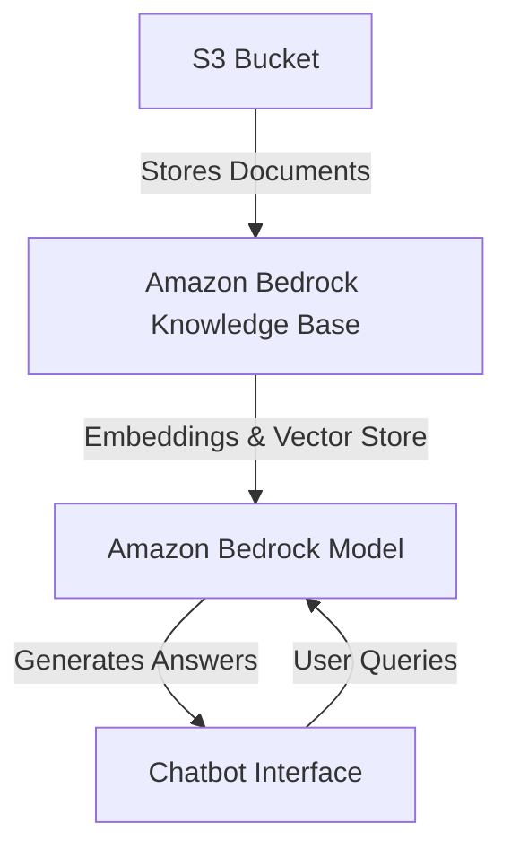

# Bedrock RAG Chatbot

A Retrieval-Augmented Generation (RAG) chatbot built with **Amazon Bedrock** and **Amazon S3**, demonstrating knowledge base integration, embeddings, and AI-powered question answering.  
Developed as part of a [NextWork](https://community.nextwork.org/) learning project.

---

## 📖 Overview
RAG is a design pattern that allows AI models to answer questions based on custom knowledge bases.  
By integrating Amazon Bedrock with S3, documents can be uploaded and then queried through the chatbot.  

This project shows how to:  
- Set up a Bedrock Knowledge Base  
- Connect it to an S3 bucket  
- Embed and chunk documents for efficient retrieval  
- Query the knowledge base using Bedrock-hosted AI models  

---

## 🛠 Tools and Services
- **Amazon Bedrock** – access and run AI models  
- **Amazon S3** – store and manage project documents  
- **Bedrock Vector Store** – fully managed embeddings and vector storage  

---

## 🔑 Key Concepts Learned
- Creating a **Knowledge Base** in Bedrock  
- Uploading and syncing documents from **S3**  
- Understanding **embeddings** (numeric representation of text)  
- Using **chunking** for processing large documents  
- Accessing AI models from the Bedrock **model catalog**  

---

## ⚡ Quickstart Guide

### 1. Create an S3 Bucket
```bash
aws s3 mb s3://my-rag-bucket --region us-east-1
````

Upload your documents:

```bash
aws s3 cp ./documents/ s3://my-rag-bucket/ --recursive
```

### 2. Set Up Knowledge Base in Bedrock

* Open **Amazon Bedrock Console**
* Create a **Knowledge Base**
* Select the S3 bucket as the data source
* Bedrock provisions a **vector store** automatically

### 3. Sync Your Data

The sync process includes:

1. **Ingestion** – retrieve files from S3
2. **Chunking** – break down large text into smaller pieces
3. **Embedding** – convert chunks into numeric vectors

### 4. Request Access to Models

Enable AI models in Bedrock:

* Llama 3.3 70B (on-demand)
* Anthropic Claude
* Amazon Titan

### 5. Test the Chatbot

* Go to the Knowledge Base in the Bedrock console
* Run queries directly in the test interface
* Out-of-scope queries return:
  *“Search results do not have any information to match the prompt.”*

---

## 🏗️ Architecture Diagram



---

## 🤖 AI Models

* **Llama 3.1 8B** → required pre-provisioning, not used
* **Llama 3.3 70B** → on-demand, successfully tested

---

## 🧪 Testing

* Verified chatbot responses only use uploaded data
* Correctly returned fallback message for irrelevant queries

---

## ⏱ Project Reflection

* Time: \~1 hour
* Rewarding aspect: chatting with a model based on personal documents
* Key outcome: strong understanding of **RAG architecture** using Bedrock

---

## 📌 Author

**Saugat Giri**
[NextWork Student](https://community.nextwork.org/c/i-have-a-question?automatic_login=true)

---

## 🔗 Resources

* [NextWork](https://nextwork.org)
* [Amazon Bedrock Documentation](https://docs.aws.amazon.com/bedrock/)
* [Amazon S3 Documentation](https://docs.aws.amazon.com/s3/)

```

Do you also want me to add a **sample code snippet (Python or JavaScript)** to query the Bedrock Knowledge Base programmatically so people can replicate it outside the console?
```
Here’s a **complete README.md** with everything pulled together:

````markdown
# Bedrock RAG Chatbot

A Retrieval-Augmented Generation (RAG) chatbot built with **Amazon Bedrock** and **Amazon S3**, demonstrating knowledge base integration, embeddings, and AI-powered question answering.  
Developed as part of a [NextWork](https://community.nextwork.org/) learning project.

---

## 📖 Overview
RAG is a design pattern that allows AI models to answer questions based on custom knowledge bases.  
By integrating Amazon Bedrock with S3, documents can be uploaded and then queried through the chatbot.  

This project shows how to:  
- Set up a Bedrock Knowledge Base  
- Connect it to an S3 bucket  
- Embed and chunk documents for efficient retrieval  
- Query the knowledge base using Bedrock-hosted AI models  

---

## 🛠 Tools and Services
- **Amazon Bedrock** – access and run AI models  
- **Amazon S3** – store and manage project documents  
- **Bedrock Vector Store** – fully managed embeddings and vector storage  

---

## 🔑 Key Concepts Learned
- Creating a **Knowledge Base** in Bedrock  
- Uploading and syncing documents from **S3**  
- Understanding **embeddings** (numeric representation of text)  
- Using **chunking** for processing large documents  
- Accessing AI models from the Bedrock **model catalog**  

---

## ⚡ Quickstart Guide

### 1. Create an S3 Bucket
```bash
aws s3 mb s3://my-rag-bucket --region us-east-1
````

Upload your documents:

```bash
aws s3 cp ./documents/ s3://my-rag-bucket/ --recursive
```

### 2. Set Up Knowledge Base in Bedrock

* Open **Amazon Bedrock Console**
* Create a **Knowledge Base**
* Select the S3 bucket as the data source
* Bedrock provisions a **vector store** automatically

### 3. Sync Your Data

The sync process includes:

1. **Ingestion** – retrieve files from S3
2. **Chunking** – break down large text into smaller pieces
3. **Embedding** – convert chunks into numeric vectors

### 4. Request Access to Models

Enable AI models in Bedrock:

* Llama 3.3 70B (on-demand)
* Anthropic Claude
* Amazon Titan

### 5. Test the Chatbot

* Go to the Knowledge Base in the Bedrock console
* Run queries directly in the test interface
* Out-of-scope queries return:
  *“Search results do not have any information to match the prompt.”*

---

## 🏗️ Architecture Diagram


---

## 🤖 AI Models

* **Llama 3.1 8B** → required pre-provisioning, not used
* **Llama 3.3 70B** → on-demand, successfully tested

---

## 🧪 Testing

* Verified chatbot responses only use uploaded data
* Correctly returned fallback message for irrelevant queries

---

## ⏱ Project Reflection

* Time: \~1 hour
* Rewarding aspect: chatting with a model based on personal documents
* Key outcome: strong understanding of **RAG architecture** using Bedrock

---

## 📌 Author

**Saugat Giri**
[NextWork Student](https://community.nextwork.org/c/i-have-a-question?automatic_login=true)

---

## 🔗 Resources

* [NextWork](https://nextwork.org)
* [Amazon Bedrock Documentation](https://docs.aws.amazon.com/bedrock/)
* [Amazon S3 Documentation](https://docs.aws.amazon.com/s3/)
